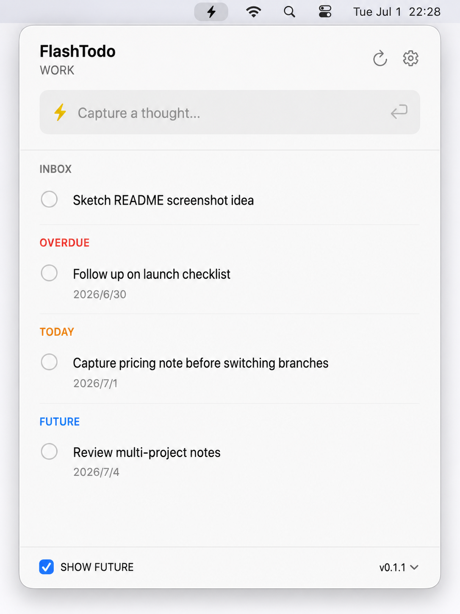

# FlashTodo

FlashTodo 是一个极轻量的 macOS 待办入口。它直接读写 Apple 提醒事项，不维护自己的任务数据库，也不把待办内容复制到额外存储里。

它适合想继续使用系统提醒事项，但希望有一个更快、更安静入口的人：打开面板、输入一句话、按 Return，任务就进入你选择的提醒事项清单。



## 为什么做

现在的 vibe coding 常常是多项目并行：一个窗口里在修 bug，另一个窗口里在试新想法，旁边还可能开着文档、终端和设计稿。很多真正有用的念头只闪一下，如果还要切到完整的待办应用、找清单、填字段，思路很容易被打断，那个念头也可能已经过去了。

FlashTodo 想解决的就是这一秒钟的问题：给一闪而过的想法一个足够快的入口。先把它记进系统提醒事项，等当前思路结束后再处理。

## 设计目标

- 极轻量：专注于快速记录、查看和处理待办。
- 无额外任务存储：任务内容只保存在 Apple 提醒事项中。
- 天然支持同步：依托 Apple 提醒事项和 iCloud，在你的 Apple 设备之间同步。
- 少打扰：菜单栏常驻，需要时打开，不需要时退到后台。
- 系统优先：复用 macOS 提醒事项权限、清单、完成状态、截止日期和优先级。

FlashTodo 只在本地偏好中保存少量界面设置，例如所选提醒事项清单、语言、面板宽度和是否显示未来任务。这些偏好不包含任务正文。

## 功能

- 快速捕获：在面板顶部输入待办，按 Return 保存到当前提醒事项清单。
- 提醒事项清单选择：可选择写入哪个 Apple Reminders 清单。
- 任务分组：按无日期、逾期、今天、未来分组显示。
- 完成与删除：直接更新 Apple 提醒事项中的原始任务。
- 编辑任务：支持修改标题、备注、截止日期和优先级。
- 未来任务开关：可以隐藏或显示未来日期的任务。
- 今日完成可见：当天完成的任务仍会显示，便于回顾刚处理完的内容。
- 中英文界面：支持自动、中文、英文。
- 登录时启动：可在设置中开启或关闭。

## 隐私与数据

FlashTodo 的目标不是成为新的待办系统，而是成为 Apple 提醒事项的轻量入口。

- 待办标题、备注、日期、完成状态和优先级都由 Apple 提醒事项保存。
- FlashTodo 不创建独立任务数据库。
- FlashTodo 不把任务内容写入自己的本地缓存。
- 数据同步由 Apple 提醒事项和 iCloud 负责，FlashTodo 不运行自己的同步服务。
- 本地偏好只保存界面和使用习惯相关的设置。
- 应用需要 Reminders 完整访问权限，才能读取、创建和编辑提醒事项。

## 系统要求

- macOS 15.0 或更高版本
- Apple 提醒事项访问权限
- 如需从源码构建：Xcode 26.6 或兼容版本

## 从源码运行

```bash
DEVELOPER_DIR=/Applications/Xcode.app/Contents/Developer \
xcodebuild -project FlashTodo.xcodeproj -scheme FlashTodo -configuration Debug -derivedDataPath build build

open -n build/Build/Products/Debug/FlashTodo.app
```

运行测试：

```bash
DEVELOPER_DIR=/Applications/Xcode.app/Contents/Developer \
xcodebuild -project FlashTodo.xcodeproj -scheme FlashTodo -configuration Debug -derivedDataPath build test
```

---

# FlashTodo

FlashTodo is a tiny macOS todo entry point. It reads and writes Apple Reminders directly, without maintaining its own task database or copying your todo content into extra storage.

It is built for people who want to keep using the system Reminders app, but want a faster and quieter way to capture and review tasks: open the panel, type a line, press Return, and the task lands in the selected Reminders list.

## Why It Exists

Modern vibe coding often means running several projects at once: fixing a bug in one window, testing an idea in another, with docs, terminals, and designs open nearby. Useful thoughts can appear for only a moment. If capturing them requires switching into a full todo app, finding the right list, and filling out fields, the current train of thought gets interrupted and the idea may already be gone.

FlashTodo is built for that one-second gap: a fast entry point for passing thoughts. Capture the idea into system Reminders first, then return to it when the current flow is done.

## Purpose

- Lightweight by design: focused on quick capture, review, and completion.
- No extra task storage: task content lives only in Apple Reminders.
- Sync by default: uses Apple Reminders and iCloud to sync across your Apple devices.
- Low interruption: stays in the menu bar and gets out of the way.
- System-first: uses macOS Reminders permissions, lists, completion state, due dates, and priority.

FlashTodo stores only a few local preferences, such as the selected Reminders list, language, panel width, and whether future tasks are shown. These preferences do not include task content.

## Features

- Quick capture: type at the top of the panel and press Return to save into the current Reminders list.
- List selection: choose which Apple Reminders list receives new tasks.
- Task sections: groups tasks into undated, overdue, today, and future.
- Complete and delete: updates the original Apple Reminders item directly.
- Edit tasks: update title, notes, due date, and priority.
- Future task toggle: hide or show tasks scheduled for later.
- Completed today stays visible: useful for reviewing what you just finished.
- Chinese and English UI: supports automatic, Chinese, and English language modes.
- Launch at login: can be enabled or disabled in settings.

## Privacy And Data

FlashTodo is not intended to be another todo system. It is a lightweight front end for Apple Reminders.

- Task titles, notes, dates, completion state, and priority are stored by Apple Reminders.
- FlashTodo does not create a separate task database.
- FlashTodo does not write task content into its own local cache.
- Sync is handled by Apple Reminders and iCloud; FlashTodo does not run its own sync service.
- Local preferences only store UI and usage settings.
- The app needs full Reminders access to read, create, and edit reminders.

## Requirements

- macOS 15.0 or later
- Apple Reminders access
- For source builds: Xcode 26.6 or a compatible version

## Run From Source

```bash
DEVELOPER_DIR=/Applications/Xcode.app/Contents/Developer \
xcodebuild -project FlashTodo.xcodeproj -scheme FlashTodo -configuration Debug -derivedDataPath build build

open -n build/Build/Products/Debug/FlashTodo.app
```

Run tests:

```bash
DEVELOPER_DIR=/Applications/Xcode.app/Contents/Developer \
xcodebuild -project FlashTodo.xcodeproj -scheme FlashTodo -configuration Debug -derivedDataPath build test
```
